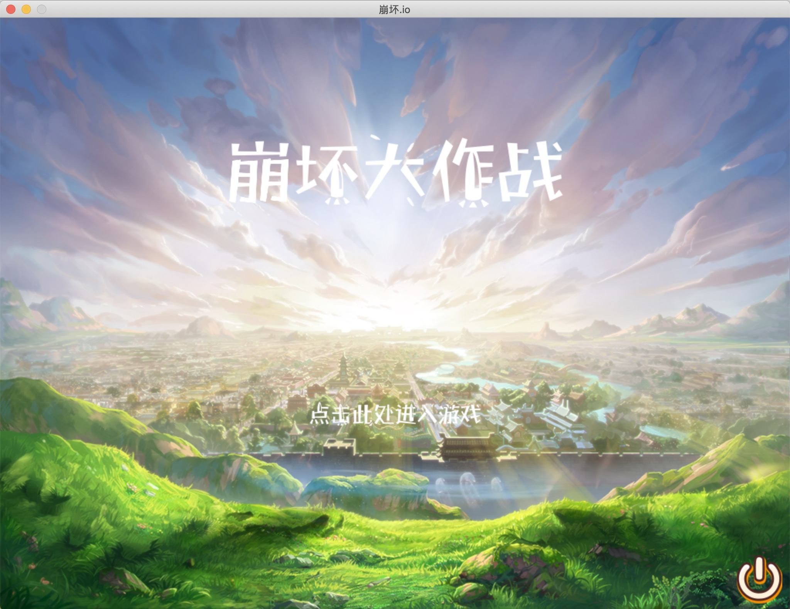

# HongKai Impact Battle(崩坏大作战)

## 1 项目背景

该项目为同济大学软件学院2019年C++程序设计课程设计项目，选题为弓箭手大作战。

选题要求：

1. 得分权值：1.1
2. 团队人数限制：<=4
3. 实现一个类似于arrow.io或弓箭手大作战的游戏。需要达成的基础功能：
   - 支持鼠标和键盘操作
   - 支持道具拾取功能
   - 支持动画
   - 支持多种不同类型的武器
   - 实现服务端：支持联机对战、电脑AI加入、多人在同一个地图上游戏

## 2 开发环境

- 操作系统：macOS High Sierra
- IDE：Xcode 10.2
- 游戏引擎：Cocos2D
- 开发语言：C++
- 测试环境：macOS High Sierra

## 3 如何运行

Mac用户可以直接下载`.app`文件，双击运行，等待片刻，防止重复打开多个游戏

其余平台暂未开发

游戏运行说明：[崩坏大作战游戏运行说明](崩坏大作战游戏运行说明.md)

演示视频：pic/展示视频.mp4

<video src="pic/展示视频.mp4"></video>

## 4 项目文件

|               文件（夹）                |            说明            |
| :-------------------------------------: | :------------------------: |
|                 Classes                 |      游戏主要的类代码      |
| Resources/A monster、monster2、monster3 |  电脑AI图片及骨骼动作资源  |
|           Resources/MUSICres            |          背景音乐          |
|             Resources/UIres             |         游戏UI资源         |
|             Resources/fonts             |          字体资源          |
|         Resources/hero1、hero2          | 玩家角色图片及骨骼动作资源 |
|             Resources/item              |      道具、子弹等资源      |
|            Resources/mapres             |        地图素材资源        |
|                 cocos2d                 |        cocos2d依赖         |
|                   pic                   |        说明文件图片        |

## 5 核心功能及实现

### 5.1 ⿏标和键盘操作

1. 简单的**侦听器**，⽤map容器存储⽅向键对应的布尔值
2. 创建侦听器，在键盘按下和放回的时候改变对应按键的布尔值。在update⾥扫描map容器各个按键的布尔值，调⽤对应方向的移动函数
3. update⾥记录当前方向与上一次扫描的方向，如果当前⽅向不同于上⼀次的⽅向，改变运⾏的动画数组，从⽽解决移动动画的卡顿问题，当所有键对应的布尔值都为0时，调⽤之前⽅向对应的站⽴动画，并将之前方向设为0，使站⽴动画避免重复调用⽽抽搐

### 5.2 道具的创建和拾取

1. 创建10个道具精灵类的组合，包括两个属性——**种类**和**是否存在**的布尔类型
2. 创建时候扫描10个精灵的是否存在值布尔值。若有0的出现变使该精灵变为新精灵，保证了了地图上最多有10个道具的出现
3. 创建的时候随机生成⼀个坐标作为道具的位置（需要进⾏碰撞检测避免道具出⽣在墙壁内），之后随机生成一个0到10的值。根据random的区间确定刷新的种类并记录为道具的属性，从而可以实现道具的概率刷新
4. Update⾥面随时调用hero与道具坐标的碰撞检测，结果为1时根据道具的属性值对主角的属性做出改变

### 5.3 电脑AI

1. 地图最多有3个敌人出现，创建3个敌⼈的精灵组，包含属性、⾎量、射程、攻击时间间隔、刷新间隔、是否存在 移动间隔、速度、射速、攻击力
2. 包含函数：创建、移动、碰撞、⽅向计算、攻击、死亡
3. update整合里⾯包含了需要在update⾥面调⽤的所有函数，使update看起来更简洁
4. 在是否存在为0与刷新间隔为1的时候调用创建函数 每次创建都会提升敌人的速度、攻击力、射速，以增加游戏性，创建时random坐标并使⽤碰撞检测
5. 在移动间隔为1的时候调⽤移动函数，移动函数⾥面调⽤方向计算函数，计算方向时先取第一个方向为敌人与英雄最能接近的方向，之后进⾏与墙壁碰撞检测，碰撞检测为1时从剩下的3个⽅向random一个值并继续碰撞检测
6. 在攻击间隔为1的时候调用攻击函数，首先直接用⾃身坐标和英雄坐标计算出攻击的最佳方向的单位向量，之后⽤射程乘以单位向量之后调⽤子弹函数
7. 在⾎量为0时调⽤死亡函数，将攻击间隔移动间隔等所有值全调为0，并完成闪烁两下的动作，闪烁动作通过不断调⽤延迟和可见度的函数实现，闪烁之后移除父类，并给出刷新间隔

### 5.4 本地排行榜

使用`UserDefault`创建包含当局得分 Score 在内的六组**键值对**,在每次进⼊排行榜界面时调用,⽤冒泡排序进行排列展示

## 6 类设计

|        类名         |       说明       |
| :-----------------: | :--------------: |
|     AppDelegate     |  cocos2d代理类   |
|   CharacterScene    |   选择角色页面   |
|     ChooseScene     |   进入选择界面   |
|    EndGameScene     |   游戏结束界面   |
|   HelloWorldScene   | 进入游戏初始界面 |
|      HeroScene      |    玩家角色类    |
|     LoginScene      |   登录控制界面   |
|       popOUT        |      弹窗类      |
|    ProgressView     |    角色血条类    |
|      RankScene      |      排行榜      |
| SingleConnectChoose |     单人模式     |
|      TeamScene      |     联机模式     |
|     WeaponScene     |   武器选择界面   |

## 7 项目进度时间线

|    时间    |                           进展                            |
| :--------: | :-------------------------------------------------------: |
| 2019.05.19 |                         搭建环境                          |
| 2019.05.30 |                   加⼊主界面、登录界面                    |
| 2019.05.31 |            增加输⼊昵称功能,并存⼊UserDefault             |
| 2019.06.01 |        加⼊选择武器和选择人物界面,实现播放背景音乐        |
| 2019.06.02 |              加⼊人物和武器界面,实现⼈物动画              |
| 2019.06.03 | 加⼊选择单机/联机模式界面,加⼊联机模式界面,实现弹出对话框 |
| 2019.06.04 |                      创建地图并添加                       |
| 2019.06.05 |                       实现⼈物移动                        |
| 2019.06.06 |                实现人物移动与移动动画结合                 |
| 2019.06.07 |                 实现⼈物与地图的碰撞检测                  |
| 2019.06.08 |                       实现人物攻击                        |
| 2019.06.09 |                 实现游戏视⻆跟随⼈物移动                  |
| 2019.06.10 |                        加⼊敌⼈AI                         |
| 2019.06.11 |                 产⽣随机道具,实现拾取道具                 |
| 2019.06.12 |              实现实时积分,人物与AI ⾎条功能               |
| 2019.06.13 |               实现⼦弹与⼈物/地图的碰撞检测               |
| 2019.06.14 |             加入人物&AI属性,多个人物&AI的加入             |
| 2019.06.15 |                     加入游戏结束界⾯                      |

## 8 项目成员

| 董震宇 | UI、地图、游戏战斗 |
| :----: | ------------------ |
|  杨础  | AI道具生成         |

 

 

 

 

 

 

 

 

 

 

